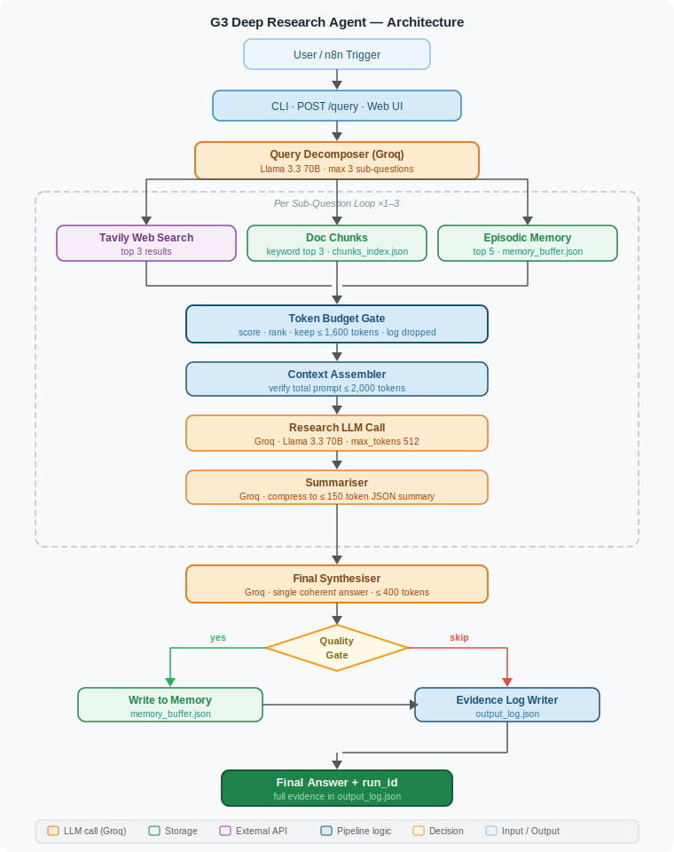
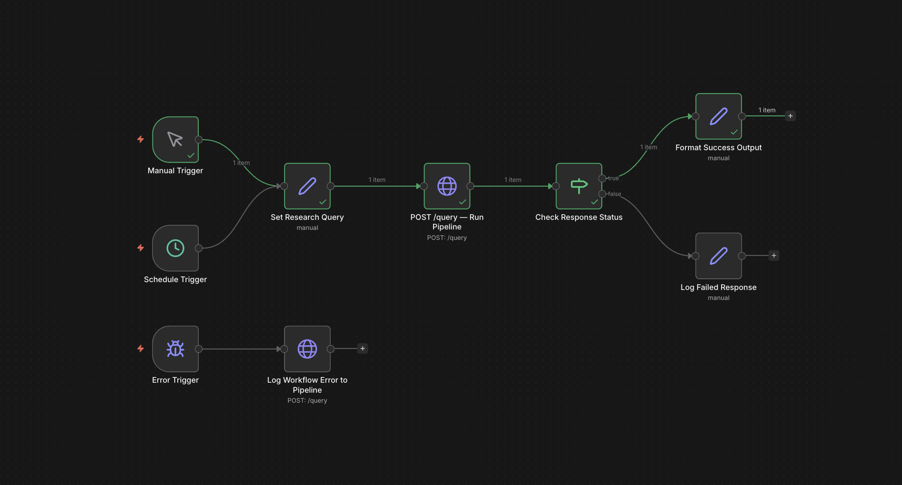

# G3 Deep Research Agent

A deep research agent that answers complex, multi-part business research questions using episodic memory, web search, and document retrieval — all within a strict 2,000-token-per-query context constraint.

Built for the Binox 2026 Take-Home Assessment — Graduate Track G3.

**Live demo:** https://g3-deep-research-agent.onrender.com

---

## Important: Single-User Prototype

**This is a single-user prototype. It is not designed for concurrent use or production deployment.**

LLM inference runs on Groq's free hosted API — no local GPU, no Ollama, no ngrok tunnel required. The only external dependencies are a Groq API key and a Tavily API key, both available free with no credit card.

---

## Architecture Summary

This project is **Node-first**. The Node.js pipeline is the core application — it handles all API calls, memory management, token budgeting, and file I/O. n8n cloud is used only as a scheduler and manual trigger, sending a single HTTP POST to the Node.js endpoint.

- **Core pipeline**: Node.js
- **LLM inference**: Groq API (free tier — Llama 3.3 70B)
- **Web search**: Tavily API (free tier)
- **Document retrieval**: User-uploaded PDFs and text files, keyword-scored
- **Memory**: Episodic buffer in flat JSON, structured summaries only
- **Token constraint**: 1,600 tokens retrieved context + 400 tokens prompt overhead = 2,000 hard ceiling per sub-question call
- **Sub-questions**: Maximum 3 per query
- **Scheduler**: n8n cloud free tier (optional — pipeline runs fine without it)
- **Storage**: Flat JSON files (no database)

See `ARCHITECTURE.md` for the full data flow and component descriptions.
See `evaluation.md` for trade-off reasoning and known limitations.



Detailed Mermaid diagrams (token budget flow, deployment topology) are in [`docs/architecture_diagram.md`](docs/architecture_diagram.md).

### n8n Workflow



---

## Business Value

### Who is this for

Strategy, research, and business development teams at SMEs and agencies who need rapid, cited answers to complex market research questions — without expensive enterprise research platforms.

**Typical user:** A consultant or BD analyst who currently opens 10 browser tabs, reads 3–5 PDFs, and manually synthesises a summary document. This agent compresses that 60–90 minute workflow to a single query.

### What problem it solves

**Problem:** Business research is slow, inconsistently cited, and non-reusable. Each analyst reinvents the same research from scratch.

**This agent provides:**
- Cited, evidence-tracked answers in under 60 seconds per query
- An episodic memory layer that accumulates knowledge across sessions — subsequent queries on the same topic benefit from prior runs automatically
- A full audit trail per run: every source kept and dropped is logged, making the answer reproducible and defensible

### Why this architecture is cheaper to demo

| Factor | This agent | Vector RAG + hosted DB alternative |
|---|---|---|
| Monthly infrastructure cost | **$0** (Groq free + Tavily free + Render free) | $20–50/month |
| Evaluator setup time | **~5 minutes** (two free API keys, `npm install`) | 30+ minutes |
| LLM quality | Llama 3.3 70B via Groq | Depends on budget |
| Memory explainability | Full JSON — human-readable | Opaque vector index |

The flat-JSON memory store is not a shortcut — it is the correct choice at prototype scale. It is human-readable, zero-infrastructure, and makes the token budget enforcement fully auditable without a database.

### Production upgrade path

Each component upgrades independently without rewriting the pipeline:

1. **Retrieval quality** → swap keyword scorer for vector embeddings (add `chromadb`)
2. **LLM provider** → change env vars only (`llmClient.js` is OpenAI-compatible)
3. **Storage** → replace JSON writes with SQLite/Postgres in `memoryBuffer.js` and `evidenceLogWriter.js`
4. **Concurrency** → add BullMQ queue in front of `runPipeline()` (function is already stateless per-run)
5. **Memory pruning** → add TTL sweep to `memoryBuffer.js` (append-only format supports this)

See `self_assessment.md` for a full rubric-aligned self-evaluation.

---

## Prerequisites

| Dependency | Version | Notes |
|---|---|---|
| Node.js | 18+ | Core runtime |
| Groq API key | — | Free at https://console.groq.com — no credit card required |
| Tavily API key | — | Free tier at tavily.com — 1,000 queries/month |
| n8n cloud account | Free tier | Optional — only needed for scheduling |

---

## Setup Instructions

### Step 1 — Clone the repository

```bash
git clone https://github.com/<your-github-username>/g3-deep-research-agent.git
cd g3-deep-research-agent
```

> **Before submitting:** replace `<your-github-username>` with your actual GitHub username and confirm the repository name matches.

### Step 2 — Install dependencies

```bash
npm install
```

### Step 3 — Configure environment variables

```bash
cp .env.example .env
```

Edit `.env` with your values:

```
GROQ_API_KEY=your_groq_api_key_here
LLM_MODEL=llama-3.3-70b-versatile
TAVILY_API_KEY=your_tavily_api_key_here
DOCS_DIR=./docs
MEMORY_BUFFER_PATH=./memory_buffer.json
OUTPUT_LOG_PATH=./output_log.json
PORT=3000
```

### Step 4 — Get a Groq API key

1. Sign up at https://console.groq.com (free, no credit card required).
2. Go to API Keys → Create API Key.
3. Copy the key and paste it as `GROQ_API_KEY` in your `.env` file.

Verify the key works:

```bash
curl https://api.groq.com/openai/v1/models -H "Authorization: Bearer $GROQ_API_KEY"
```

### Step 5 — Add documents to the knowledge base (optional)

Place any `.pdf` or `.txt` files you want the agent to search into the `/docs` directory:

```bash
cp your-report.pdf ./docs/
```

Run the document chunker to index them:

```bash
node src/chunker.js
```

This creates `chunks_index.json`. Re-run whenever you add or remove documents. If `/docs` is empty the agent still works — it will rely on web search and memory only.

### Step 6 — Run the smoke test

Verify everything is connected before running a real query:

```bash
node smoke_test.js
```

Expected output:

```
PASS: output_log.json has new entry
PASS: final_answer is non-empty
PASS: sub_questions has 2–3 items (max 3)
PASS: sources_used is non-empty
PASS: no sub-question context exceeded 2,000 tokens
```

### Step 6b — Run unit tests

```bash
node tests/unit.js
```

Tests cover token counting, keyword scoring, deduplication, budget gate logic, and memory quality gate.

### Step 7 — Run a query (command line — no n8n needed)

```bash
node src/pipeline.js "What are the biggest challenges facing D2C consumer brands in 2025 and how are leading brands responding?"
```

The final answer is printed to stdout. The full evidence record is appended to `output_log.json`.

### Step 8 — Run a query via HTTP

**Option A — with the explicit server flag:**

    node src/pipeline.js --server

**Option B — no arguments also starts the server** (this is what Render uses):

    node src/pipeline.js

Send a query:

    curl -X POST http://localhost:3000/query \
      -H "Content-Type: application/json" \
      -d '{"query": "What are the biggest challenges facing D2C consumer brands in 2025?"}'

### Step 8b — Open the web interface

With the server running (`node src/pipeline.js`), open your browser to:

    http://localhost:3000

The web interface lets you submit queries, view results, and browse past runs.
This is the same server that handles API requests — no additional setup needed.

### Step 9 — Connect n8n cloud (optional, for scheduling only)

This step is only needed if you want n8n to trigger the pipeline on a schedule. Manual queries work without n8n.

**Choose your setup:**

#### Option A — Running locally (ngrok required)

n8n cloud cannot reach your local machine. Run ngrok to expose the pipeline:

    ngrok http 3000

Copy the HTTPS forwarding URL (e.g. `https://abc123.ngrok.io`). Use this as the target URL in Step 9b below.

#### Option B — Running on Render (no ngrok needed)

If you have deployed to Render, your pipeline is already publicly accessible at `https://<your-service>.onrender.com`. Skip ngrok entirely and use your Render URL in Step 9b.

#### Step 9b — Import the n8n workflow

1. Log in to n8n cloud at app.n8n.cloud
2. Workflows → Import → upload `n8n_workflow_export.json`
3. In the HTTP Request node, set the URL to:
   - Hosted: `https://g3-deep-research-agent.onrender.com/query`
   - Local: `https://<your-ngrok-id>.ngrok.io/query`
4. Add your Tavily API key in n8n's credential manager (Settings → Credentials → New)
5. Save and activate the workflow

> **Note:** The n8n workflow POSTs to `/query` and does nothing else. All pipeline logic runs in Node.js — n8n is a thin trigger only.

> **If the pipeline fails:** check `output_log.json` for the failed run entry — the pipeline logs all failures internally.

---

## Demonstrating Episodic Memory

To show the memory layer working, run two related queries in sequence:

```bash
node src/pipeline.js "What are the key trends in B2B SaaS pricing models in 2025?"
node src/pipeline.js "How are B2B SaaS companies adjusting go-to-market strategy in response to pricing pressure?"
```

The second run should retrieve a summary from the first run via the episodic buffer. Check `output_log.json` — the second entry's `context_kept` array should contain an item with `type: "memory"`.

---

## Sample Run

**Query**

```
node src/pipeline.js "What pricing strategies are B2B SaaS companies using in 2025?"
```

**Final answer** (from `run_id: 840f3eed`, `2026-04-06T22:57:23Z`)

> B2B SaaS companies are adopting pricing models that align with customer needs and usage habits [Q1]. The most popular approach is the monthly subscription model, used by nearly 47% of companies, followed by tiered pricing [Q1]. To determine the optimal price for their products or services, companies consider factors such as the value their product provides to the customer, production costs, customer willingness to pay, and competitor research [Q2]. They also conduct customer interviews, create buyer personas, and analyze customer data to inform their pricing strategy [Q2].
>
> Value metrics, customer segmentation, and competition play significant roles in shaping B2B SaaS pricing strategies [Q3]. Segmentation allows for differentiated pricing, capturing variance in willingness-to-pay without abandoning lower-profit segments [Q3]. By considering these factors and adopting flexible pricing models, B2B SaaS companies can create pricing strategies that meet the diverse needs of their customers [Q1].

**What the pipeline did** (from `output_log.json`)

| Step | Detail |
|---|---|
| Sub-questions generated | 3 (decomposer prompt → Groq) |
| Web sources fetched | Tavily — 8 URLs across 3 sub-questions |
| Doc chunks retrieved | `ai_enterprise_adoption_2025.txt`, `remote_work_policy_2025.txt` |
| Memory hits | 5 entries retrieved from prior session on same topic |
| Tokens used (per sub-question) | 1,566 / 1,377 / 1,435 — all under 1,600 ceiling |
| Tokens dropped (budget gate) | 0 / 692 / 399 — logged with `reason: "budget exceeded"` |
| Status | `success` |

**Evidence log snippet** (truncated)

```json
{
  "run_id": "840f3eed-4cfe-4702-8767-3be2b0fe76ea",
  "model_used": "llama-3.3-70b-versatile",
  "status": "success",
  "token_usage": [
    { "sub_question": "What are the most common pricing models...", "tokens_used": 1566, "tokens_dropped": 0,   "low_confidence": false },
    { "sub_question": "How do B2B SaaS companies determine...",     "tokens_used": 1377, "tokens_dropped": 692, "low_confidence": true  },
    { "sub_question": "What role do value metrics...",              "tokens_used": 1435, "tokens_dropped": 399, "low_confidence": false }
  ],
  "context_dropped": [
    { "source": "supply_chain_trends_2025.txt:0", "tokens": 399, "reason": "budget exceeded" },
    { "source": "remote_work_policy_2025.txt:1",  "tokens": 293, "reason": "budget exceeded" }
  ],
  "retrieval_quality": [
    { "sub_question": "What are the most common pricing models...", "is_weak": false, "top_score": 0.294 },
    { "sub_question": "How do B2B SaaS companies determine...",     "is_weak": true,  "top_score": 0.071, "reason": "Top relevance score (0.071) is below 0.15 threshold." },
    { "sub_question": "What role do value metrics...",              "is_weak": false, "top_score": 0.192 }
  ]
}
```

The `low_confidence: true` flag on sub-question 2 shows the retrieval quality gate working — the keyword scorer found low relevance (score 0.071) and flagged the answer rather than suppressing it. The full log is in [`sample_output_log.json`](sample_output_log.json).

---

## Project Structure

```
/
├── src/
│   ├── pipeline.js             # Entry point — CLI + HTTP server
│   ├── chunker.js              # Document indexer (run once at setup)
│   ├── tokenCounter.js         # Token count approximation utility
│   ├── keywordScorer.js        # BM25-style keyword overlap scorer
│   ├── llmClient.js            # Groq HTTP client (OpenAI-compatible)
│   ├── tavilyClient.js         # Tavily HTTP client
│   ├── memoryBuffer.js         # Episodic memory read/write
│   ├── tokenBudgetGate.js      # Rank and trim context to 1,600 tokens
│   ├── contextAssembler.js     # Build final prompt, verify ≤ 2,000 tokens
│   ├── evidenceLogWriter.js    # Append to output_log.json
│   └── prompts/
│       ├── decomposer.js       # Decomposition prompt (max 3 sub-questions)
│       ├── summariser.js       # Sub-answer compression prompt
│       └── synthesiser.js      # Final synthesis prompt
├── public/
│   ├── index.html              # Web interface
│   ├── style.css               # Styles (no external dependencies)
│   └── app.js                  # Frontend logic (vanilla JS)
├── docs/                       # Place uploaded PDFs and text files here
├── n8n_workflow_export.json    # Import into n8n cloud for scheduling (optional)
├── render.yaml                 # Render hosting blueprint
├── tests/
│   └── unit.js                 # Unit tests for non-LLM deterministic logic
├── smoke_test.js               # End-to-end smoke test
├── .env.example                # Environment variable template
├── .gitignore
├── ARCHITECTURE.md
├── CLAUDE.md
├── SECURITY.md
├── evaluation.md
└── README.md
```

---

## Environment Variables

| Variable | Default | Required |
|---|---|---|
| `GROQ_API_KEY` | — | Yes |
| `LLM_MODEL` | `llama-3.3-70b-versatile` | No |
| `TAVILY_API_KEY` | — | Yes |
| `DOCS_DIR` | `./docs` | No |
| `MEMORY_BUFFER_PATH` | `./memory_buffer.json` | No |
| `OUTPUT_LOG_PATH` | `./output_log.json` | No |
| `PORT` | `3000` | No |

---

## Quality Controls

- **Run status tracking**: Every run is logged as `success`, `failed`, or `partial`. Failed runs include an `error_message` field.
- **Memory quality gate**: Only successful runs with at least one non-memory source are written to the episodic memory buffer. Failed or low-evidence runs do not pollute future retrieval.
- **Context deduplication**: Duplicate sources are removed before the token budget gate, ensuring the 1,600-token context budget is spent on unique evidence.
- **Low-confidence detection**: When retrieval quality is weak (no fresh web or document sources, low relevance scores), the agent flags the answer as low-confidence and avoids broad extrapolation.
- **Sample output curation**: `sample_output_log.json` contains only successful, well-sourced runs that demonstrate the agent's capabilities including the budget constraint.

---

## Known Limitations

- **Single-user prototype** — no concurrent run safety. Do not trigger multiple runs simultaneously.
- **Groq free tier rate limits** — 30 requests/minute may throttle batch runs.
- Token counting is approximate (±10%). See `evaluation.md`.
- Document retrieval is keyword-based only — synonym mismatches reduce recall.
- Memory buffer grows without pruning in v1. Reset by clearing `memory_buffer.json` to `[]`.

Full trade-off discussion in `evaluation.md`.

---

## Deployment (Render — Free Tier)

This app can be deployed to Render's free tier directly from the GitHub repo. Since the LLM runs on Groq's hosted API (not locally), no GPU or high-RAM server is needed.

### Prerequisites
- A Render account (free at https://render.com)
- A Groq API key (free at https://console.groq.com)
- A Tavily API key (free at https://tavily.com)

### Deploy steps
1. Push this repo to GitHub.
2. Log in to Render → New → Web Service → Connect your GitHub repo.
3. Render auto-detects `render.yaml` and configures the service.
4. Set environment variables in Render's dashboard:
   - `GROQ_API_KEY` — your Groq API key
   - `LLM_MODEL` — model name (default: `llama-3.3-70b-versatile`)
   - `TAVILY_API_KEY` — your Tavily API key
5. Deploy. The web interface will be available at `https://<your-service>.onrender.com`.

### Limitations on Render free tier
- Free tier services spin down after 15 minutes of inactivity. First request after spin-down takes ~30 seconds to cold-start.
- Free tier has 512MB RAM. The Node.js pipeline itself is lightweight, but keep document uploads small.
- `output_log.json` and `memory_buffer.json` are stored on Render's ephemeral filesystem — they reset on every deploy or restart. This is acceptable for a demo.
- Groq free tier rate limits (30 req/min) may throttle batch runs.

