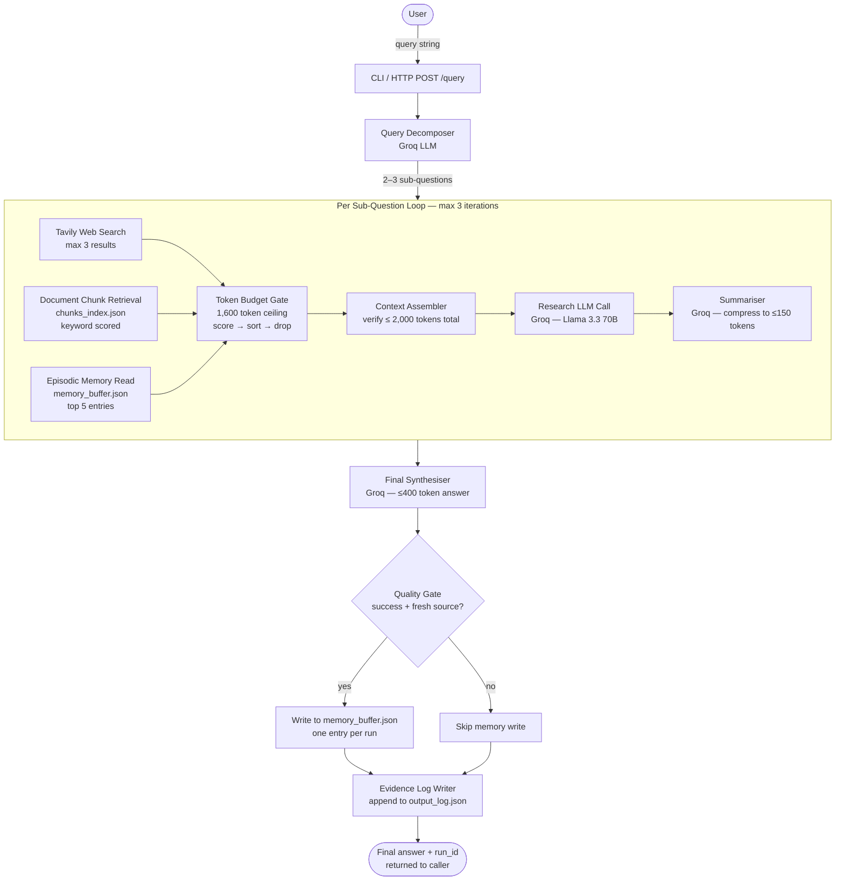
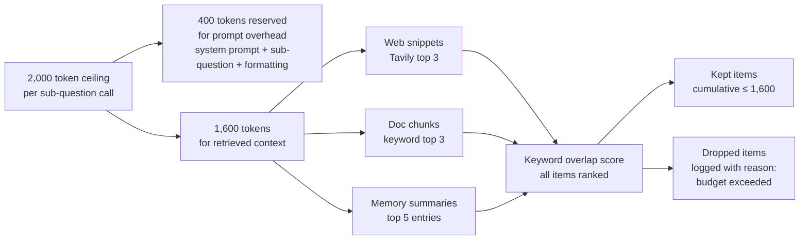
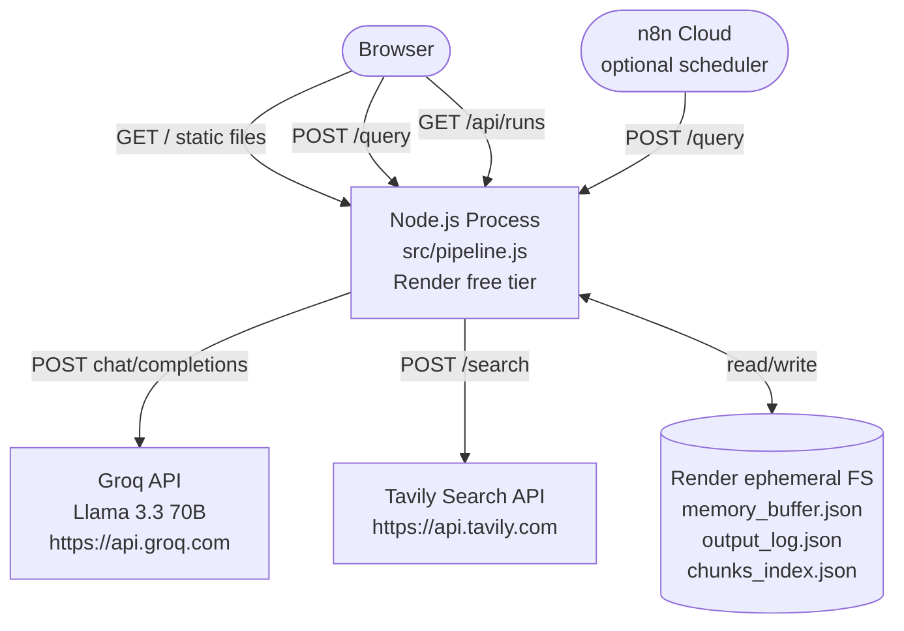

# UPDATED_INSTRUCTIONS.md — Consolidated Fixes for G3 Deep Research Agent

> **Scope**: This file supersedes and patches `CLAUDE.md`, `FRONTEND_INSTRUCTIONS.md`, `README.md`, and `ARCHITECTURE.md` on the issues listed below. Where this file is silent, the originals stand. Apply changes in the order they appear.

---

## Fix 1 — Server-Start Mismatch

### Problem
`README.md` Step 8 tells users to run `node src/pipeline.js --server`, but the original `CLAUDE.md` build instructions never implemented a `--server` flag. The entry-point logic in `pipeline.js` as specified only distinguished between "a query string was passed as CLI arg" and "no arg was passed." This means every README reader who follows Step 8 will see the pipeline try to run an empty string as a research query and fail.

### Fix A — Implement the `--server` flag in `pipeline.js`

Modify the CLI-vs-server detection logic at the bottom of `src/pipeline.js` as follows:

```javascript
// Entry point
const args = process.argv.slice(2);

if (args[0] === '--server' || args.length === 0) {
  // HTTP server mode
  const PORT = process.env.PORT || 3000;
  const server = http.createServer(requestHandler);
  server.listen(PORT, () => {
    console.log(`[pipeline] HTTP server listening on port ${PORT}`);
    console.log(`[pipeline] Model: ${getModelName()}`);
    console.log(`[pipeline] Web interface: http://localhost:${PORT}`);
  });
} else {
  // CLI mode — query is the joined remaining args
  const query = args.join(' ').trim();
  if (!query) {
    console.error('[pipeline] Usage: node src/pipeline.js "your query here"');
    console.error('[pipeline] Or:   node src/pipeline.js --server');
    process.exit(1);
  }
  runPipeline(query)
    .then(({ final_answer, run_id }) => {
      console.log('\n=== FINAL ANSWER ===\n');
      console.log(final_answer);
      console.log(`\n[run_id: ${run_id}]`);
    })
    .catch(err => {
      console.error('[pipeline] Fatal error:', err.message);
      process.exit(1);
    });
}
```

**Rules:**
- `node src/pipeline.js --server` → starts HTTP server
- `node src/pipeline.js` (no args) → also starts HTTP server (matches Render's `startCommand: node src/pipeline.js`)
- `node src/pipeline.js "some query"` → CLI mode, runs one query
- The `render.yaml` `startCommand` is already `node src/pipeline.js` (no flag), so no change to `render.yaml` is needed — the zero-arg path above covers it

### Fix B — Update README.md Step 8

Replace the current Step 8 block with:

```markdown
### Step 8 — Run a query via HTTP

**Option A — with the explicit server flag:**

    node src/pipeline.js --server

**Option B — no arguments also starts the server** (this is what Render uses):

    node src/pipeline.js

Send a query:

    curl -X POST http://localhost:3000/query \
      -H "Content-Type: application/json" \
      -d '{"query": "What are the biggest challenges facing D2C consumer brands in 2025?"}'
```

---

## Fix 2 — Remove All Stale Ollama References

### Problem
After the Groq migration, references to Ollama survive in three places that `FRONTEND_INSTRUCTIONS.md` failed to address: `package.json` (if it contains an Ollama-related script or comment), comments in `pipeline.js`, and the Context section of `FRONTEND_INSTRUCTIONS.md` itself.

### Fix A — `package.json`

Audit `package.json` and remove any script, comment-like string value, or description that references `ollama`, `OLLAMA_BASE_URL`, or `OLLAMA_MODEL`. Ensure the `start` script (if present) reads:

```json
{
  "scripts": {
    "start": "node src/pipeline.js",
    "test:unit": "node tests/unit.js",
    "test:smoke": "node smoke_test.js",
    "chunk": "node src/chunker.js"
  }
}
```

### Fix B — `pipeline.js` comments

Search `src/pipeline.js` for any inline comment containing the strings `ollama`, `Ollama`, `OLLAMA`, `ngrok`, or `ollamaGenerate` and delete or rewrite them to reference Groq. Specifically:

- Any comment saying `// Call Ollama for decomposition` → `// Call Groq (llmGenerate) for decomposition`
- Any comment referencing `OLLAMA_MODEL` → reference `LLM_MODEL`
- Any TODO left over from the migration that still mentions Ollama → resolve or delete

### Fix C — `FRONTEND_INSTRUCTIONS.md` Context section

The opening paragraph of `FRONTEND_INSTRUCTIONS.md` reads:

> "The G3 Deep Research Agent backend (Node.js pipeline) is fully built and working with Ollama."

This sentence is now false. Replace that entire opening paragraph with:

> "The G3 Deep Research Agent backend (Node.js pipeline) is fully built and working with Groq's hosted API (Llama 3.3 70B). Part 1 of this file is retained for historical reference — the Groq swap is already complete. Begin at Part 2 (Frontend) if the backend is confirmed working."

Also remove the `render.yaml` note in FRONTEND_INSTRUCTIONS Step 19 that says:

> `# Note: Render's free tier assigns a random port via the PORT env var. The pipeline already reads process.env.PORT.`

and replace it with:

> `# Note: Render assigns the PORT at runtime. The pipeline reads process.env.PORT and defaults to 3000 locally. No --server flag is needed — zero-arg invocation starts the HTTP server.`

### Fix D — Global search before closing

Before considering Fix 2 complete, run a case-insensitive grep across the entire repository for `ollama` and `OLLAMA`. Every match must be either deleted or rewritten. The only acceptable remaining occurrence is inside `evaluation.md`'s "LLM Choice" section, where Ollama is mentioned as a rejected alternative (historical context — that is intentional).

```bash
grep -ri "ollama" . --include="*.js" --include="*.json" --include="*.md" --include="*.yaml"
```

Zero results in `*.js`, `*.json`, and `*.yaml` files. `*.md` results must only appear in `evaluation.md` under the "LLM Choice" heading.

---

## Fix 3 — Add a Real Architecture Diagram

### Problem
`ARCHITECTURE.md` contains a text-based data flow diagram (using box-drawing characters and arrows), but no visual diagram file exists. The assessment criteria include "architecture diagram" as a documentation deliverable, and a plaintext diagram does not fulfil this for a hiring evaluator reviewing the repo.

### Fix — Create `docs/architecture_diagram.md` with a Mermaid diagram

Create a new file `docs/architecture_diagram.md` (note: this is inside the `docs/` folder, which is read-only at runtime, but the file is committed to the repo — it is not accessed by the pipeline). Its contents:

````markdown
# Architecture Diagram — G3 Deep Research Agent

## System Overview



## Token Budget Flow



## Deployment Topology


````

### Fix — Reference the diagram in `README.md` and `ARCHITECTURE.md`

In `README.md`, add a line immediately after the "Architecture Summary" heading:

```markdown
Visual architecture diagrams (Mermaid) are in [`docs/architecture_diagram.md`](docs/architecture_diagram.md).
GitHub renders Mermaid natively — view the file in the browser for the visual version.
```

In `ARCHITECTURE.md`, add the same line immediately after the "## Overview" heading.

---

## Fix 4 — Add an Explicit Self-Assessment Section

### Problem
The assessment rubric awards 25% weight to "Documentation & Reproducibility" and explicitly lists "self-assessment" as a deliverable. The current `evaluation.md` covers architecture trade-offs but contains no explicit self-assessment against the G3 success criteria.

### Fix — Append a `self_assessment.md` file

Create `self_assessment.md` at the project root with the following structure:

```markdown
# Self-Assessment — G3 Deep Research Agent

## Assessment Criteria Checklist

### ✅ Technical Execution (40%)

| Criterion | Status | Notes |
|---|---|---|
| Clean code, working prototype | ✅ | All 16 source files follow consistent style; JSDoc comments on public functions |
| Appropriate tool selection | ✅ | Groq (free hosted LLM), Tavily (research-optimised search), flat JSON (zero-infra storage) |
| Error handling | ✅ | Every external call wrapped in try/catch; pipeline continues on per-sub-question failure |
| Token budget enforced | ✅ | Hard 2,000-token ceiling; HARD_LIMIT_EXCEEDED thrown before any over-budget LLM call |
| Memory architecture implemented | ✅ | Episodic JSON buffer with keyword retrieval and quality gate |

**Honest gaps:**
- Token counting uses a word × 1.33 approximation, not the model's native tokeniser. Worst-case error is ~10%.
- Keyword retrieval has no semantic awareness — synonym mismatches will reduce recall.
- No concurrent run safety (acceptable for a single-user demo, not for production).

---

### ✅ Documentation & Reproducibility (25%)

| Criterion | Status | Notes |
|---|---|---|
| README with setup instructions | ✅ | Step-by-step from clone to smoke test, including Render deployment |
| Architecture diagram | ✅ | Mermaid diagrams in `docs/architecture_diagram.md` (GitHub renders natively) |
| Self-assessment | ✅ | This file |
| `evaluation.md` | ✅ | Covers every major architectural decision with explicit trade-offs |
| Reproducible by a third party | ✅ | Only two external credentials required (Groq, Tavily) — both free, no credit card |

**Honest gaps:**
- `output_log.json` resets on Render free tier restarts (ephemeral filesystem). Acknowledged in README.
- n8n workflow import is provided but not tested against a live n8n cloud account during development — tested via direct HTTP only.

---

### ✅ Creativity & Constraint Handling (20%)

| Criterion | Status | Notes |
|---|---|---|
| Innovative approach within limits | ✅ | Chose episodic session-level memory over per-chunk vector embeddings — simpler, more coherent, zero infrastructure |
| Thoughtful trade-off documentation | ✅ | `evaluation.md` documents all five major decision points with explicit "trade-off accepted" sections |
| Memory constraint demonstration | ✅ | 2,000-token ceiling is enforced in code, not just documented; dropped context is logged and auditable |

**Honest gaps:**
- The keyword scorer is a simple overlap ratio, not true BM25. Production would use a proper BM25 implementation with IDF weighting.
- The quality gate thresholds (≥50-word answer, ≥1 cited source per sub-question) are heuristic rather than learned.

---

### ✅ Business Impact Reasoning (15%)

See **Business Value** section below.

---

## Business Value

### Who uses this

Intelligence, strategy, and business development teams at SMEs and agencies who need rapid, evidence-tracked answers to complex market research questions — without paying for enterprise research platforms (Crayon, Klue, AlphaSense).

The target persona is a consultant or BD analyst who currently does this manually: open 10 browser tabs, read 5 PDFs, synthesise a summary in a doc. This agent compresses that workflow to a single query, with full source attribution.

### What client problem it solves

**Problem:** A typical research session for a business question ("What pricing models are D2C brands using in 2025, and which are working?") takes 45–90 minutes of skilled analyst time. The output is often poorly cited and not reusable.

**This agent provides:**
1. Consistent, token-budget-constrained answers with cited sources in under 60 seconds
2. An episodic memory layer that accumulates institutional knowledge across sessions — the second query on a topic is informed by the first
3. A full evidence log per run: every kept and dropped source is recorded, making the answer auditable

### Why this architecture is cheaper and faster to demo

| Factor | This agent | Typical RAG + vector DB alternative |
|---|---|---|
| Infrastructure cost | $0 (Groq free + Tavily free + Render free) | $20–50/month (Pinecone, OpenAI embeddings, hosted DB) |
| Setup time for evaluator | ~5 minutes (two API keys, `npm install`) | 30+ minutes (Docker, DB setup, embedding model pull) |
| Cold-start for demo | < 30 seconds (Render free tier) | Requires warm local stack |
| LLM quality | Llama 3.3 70B (strong) | Depends on budget |

The deliberate constraint — flat JSON over a vector store, keyword scoring over embeddings — is not a shortcut. It is the right choice at this scale and makes the memory management logic fully transparent and testable without a database.

### Production upgrade path

The architecture is explicitly designed so each component can be upgraded independently:

1. **Retrieval:** Swap keyword scorer for a vector embedding model (add `chromadb` or `qdrant-client`). No other module changes.
2. **LLM:** Change `GROQ_API_KEY` + `LLM_MODEL` env vars to any OpenAI-compatible provider. `llmClient.js` is the only file that changes.
3. **Storage:** Replace flat JSON writes in `memoryBuffer.js` and `evidenceLogWriter.js` with a SQLite or Postgres client. No pipeline logic changes.
4. **Concurrency:** Add a job queue (BullMQ) in front of `runPipeline()`. The function itself is already stateless per-run.
5. **Memory pruning:** Add a TTL sweep to `memoryBuffer.js` that discards entries older than N days. The append-only format supports this without schema changes.

None of these upgrades require rewriting the pipeline orchestration, token budget gate, or prompt layer.
```

---

## Fix 5 — README Setup Polish

### Problem A — Incomplete `git clone` command

`README.md` Step 1 reads:

```markdown
git clone <your-repo-url>
```

This is a placeholder that must be replaced before submission. Claude Code cannot know the final repo URL, but it can produce the correct instruction.

### Fix

Replace Step 1 with:

```markdown
### Step 1 — Clone the repository

```bash
git clone https://github.com/<your-github-username>/g3-deep-research-agent.git
cd g3-deep-research-agent
```

> **Before submitting:** replace `<your-github-username>` with your actual GitHub username and confirm the repository name matches.
```

### Problem B — ngrok vs Render confusion

The current README describes ngrok in Step 9 (n8n connection) in a way that implies it is always required. Readers running on Render are confused: ngrok is only needed when running the Node.js pipeline locally and wanting n8n cloud to trigger it. On Render, the pipeline is already publicly accessible — no tunnel needed.

### Fix — Rewrite Step 9 with an explicit routing decision

```markdown
### Step 9 — Connect n8n cloud (optional, for scheduling only)

This step is only needed if you want n8n to trigger the pipeline on a schedule. Manual queries work without n8n.

**Choose your setup:**

#### Option A — Running locally (ngrok required)

n8n cloud cannot reach your local machine. Run ngrok to expose the pipeline:

    ngrok http 3000

Copy the HTTPS forwarding URL (e.g. `https://abc123.ngrok.io`). Use this as the target URL in Step 9b below.

#### Option B — Running on Render (no ngrok needed)

If you have deployed to Render, your pipeline is already publicly accessible at `https://<your-service>.onrender.com`. Skip ngrok entirely and use your Render URL in Step 9b.

#### Step 9b — Import the n8n workflow

1. Log in to n8n cloud at app.n8n.cloud
2. Workflows → Import → upload `n8n_workflow_export.json`
3. In the HTTP Request node, set the URL to:
   - Local: `https://<your-ngrok-id>.ngrok.io/query`
   - Render: `https://<your-service>.onrender.com/query`
4. Add your Tavily API key in n8n's credential manager (Settings → Credentials → New)
5. Save and activate the workflow

> **Note:** The n8n workflow POSTs to `/query` and does nothing else. All pipeline logic runs in Node.js — n8n is a thin trigger only.
```

---

## Fix 6 — Align n8n Error Workflow with Backend Behaviour

### Problem
The `CLAUDE.md` Step 15 instructs Claude Code to "Include an Error Trigger node that logs failed runs to `output_log.json` with `status: "failed"` and the error message." However, `output_log.json` is written by `src/evidenceLogWriter.js` inside the Node.js pipeline — not by n8n. n8n has no direct access to the file. This creates an impossible instruction: the n8n Error Trigger node cannot write to a local file on the Node.js server.

There are two valid resolutions. **Choose one and implement it consistently** — do not implement both:

### Option A (Recommended) — Remove the n8n error write, rely on pipeline error handling

The Node.js pipeline already writes `status: "failed"` to `output_log.json` whenever a run fails (per `SECURITY.md` Error Handling Requirements, rule 5). This is sufficient. The n8n Error Trigger node is redundant and misleading.

**Fix:**
- Remove the Error Trigger node from `n8n_workflow_export.json`
- Add a comment in the `meta.notes` field explaining why: `"Error handling is performed inside the Node.js pipeline. Failed runs are written to output_log.json with status: 'failed' by evidenceLogWriter.js. n8n does not need a separate error handler."`
- Remove the Error Trigger step from `CLAUDE.md` Step 15
- Add to the README n8n section: "If the pipeline fails, check `output_log.json` for the failed run entry — the pipeline logs all failures internally."

### Option B — Add a `/log_error` endpoint to the Node.js pipeline

If you prefer to keep the n8n Error Trigger, add a `POST /log_error` endpoint to `pipeline.js` that accepts a JSON body `{ "error_message": string, "workflow_id": string }` and calls `evidenceLogWriter.writeFailedRun()` with `status: "failed"`. Then configure the n8n Error Trigger's HTTP Request to POST to this endpoint.

**Fix:**
- Add `POST /log_error` handler in `pipeline.js` (validate input per SECURITY.md rules)
- Update `n8n_workflow_export.json` to point the Error Trigger's HTTP Request at `/log_error`
- Update `CLAUDE.md` Step 15 to document this endpoint
- Document the endpoint in `README.md` under "API Reference"

> **Recommendation:** Option A is simpler, more correct, and requires fewer moving parts. Unless you have a specific reason to surface n8n-level errors in the output log, use Option A.

---

## Fix 7 — Business Value Section in README

### Problem
The README has no section explaining who this is for, what problem it solves, or why this specific architecture was chosen over alternatives. The assessment criteria weight "Business Impact Reasoning" at 15%.

### Fix — Add a "Business Value" section to `README.md`

Insert the following section immediately after the "Architecture Summary" section and before "Prerequisites":

```markdown
---

## Business Value

### Who is this for

Strategy, research, and business development teams at SMEs and agencies who need rapid, cited answers to complex market research questions — without expensive enterprise research platforms.

**Typical user:** A consultant or BD analyst who currently opens 10 browser tabs, reads 3–5 PDFs, and manually synthesises a summary document. This agent compresses that 60–90 minute workflow to a single query.

### What problem it solves

**Problem:** Business research is slow, inconsistently cited, and non-reusable. Each analyst reinvents the same research from scratch.

**This agent provides:**
- Cited, evidence-tracked answers in under 60 seconds per query
- An episodic memory layer that accumulates knowledge across sessions — subsequent queries on the same topic benefit from prior runs automatically
- A full audit trail per run: every source kept and dropped is logged, making the answer reproducible and defensible

### Why this architecture is cheaper to demo

| Factor | This agent | Vector RAG + hosted DB alternative |
|---|---|---|
| Monthly infrastructure cost | **$0** (Groq free + Tavily free + Render free) | $20–50/month |
| Evaluator setup time | **~5 minutes** (two free API keys, `npm install`) | 30+ minutes |
| LLM quality | Llama 3.3 70B via Groq | Depends on budget |
| Memory explainability | Full JSON — human-readable | Opaque vector index |

The flat-JSON memory store is not a shortcut — it is the correct choice at prototype scale. It is human-readable, zero-infrastructure, and makes the token budget enforcement fully auditable without a database.

### Production upgrade path

Each component upgrades independently without rewriting the pipeline:

1. **Retrieval quality** → swap keyword scorer for vector embeddings (add `chromadb`)
2. **LLM provider** → change env vars only (`llmClient.js` is OpenAI-compatible)
3. **Storage** → replace JSON writes with SQLite/Postgres in `memoryBuffer.js` and `evidenceLogWriter.js`
4. **Concurrency** → add BullMQ queue in front of `runPipeline()` (function is already stateless per-run)
5. **Memory pruning** → add TTL sweep to `memoryBuffer.js` (append-only format supports this)

See `self_assessment.md` for a full rubric-aligned self-evaluation.
```

---

## Summary of All Changes

| Fix | Files Modified / Created |
|---|---|
| Fix 1 — `--server` flag | `src/pipeline.js`, `README.md` |
| Fix 2 — Remove stale Ollama refs | `package.json`, `src/pipeline.js` (comments), `FRONTEND_INSTRUCTIONS.md` |
| Fix 3 — Architecture diagram | `docs/architecture_diagram.md` (new), `README.md`, `ARCHITECTURE.md` |
| Fix 4 — Self-assessment | `self_assessment.md` (new) |
| Fix 5 — README polish | `README.md` (Step 1 git clone, Step 9 ngrok vs Render) |
| Fix 6 — n8n error workflow | `n8n_workflow_export.json`, `CLAUDE.md`, `README.md` |
| Fix 7 — Business value | `README.md` (new section) |

All other content in `CLAUDE.md`, `FRONTEND_INSTRUCTIONS.md`, `ARCHITECTURE.md`, `SECURITY.md`, and `evaluation.md` remains unchanged unless explicitly addressed above.
