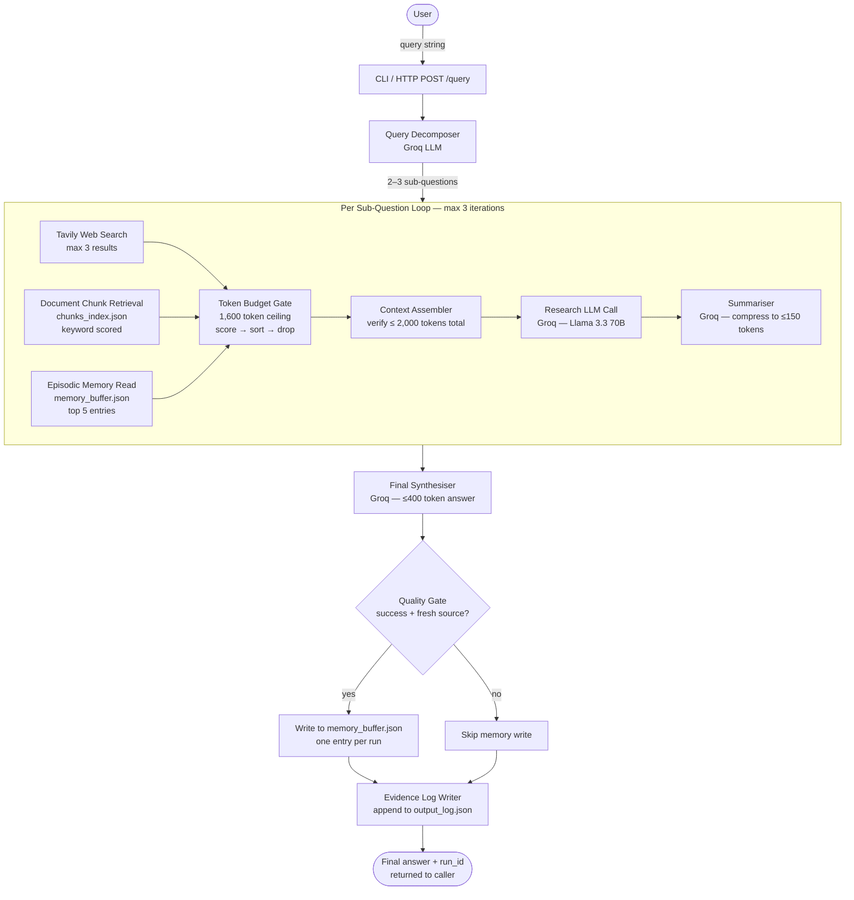
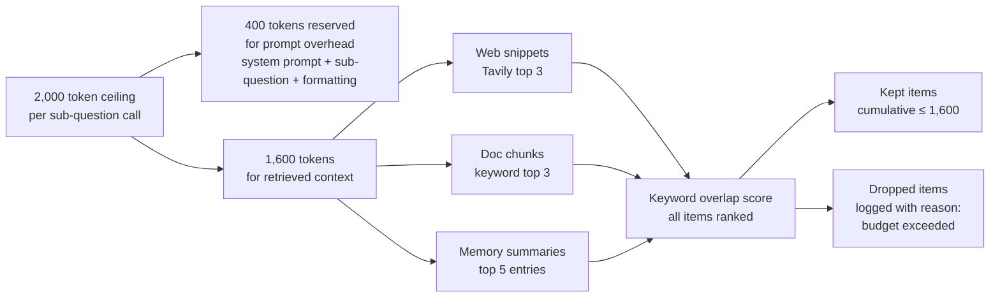
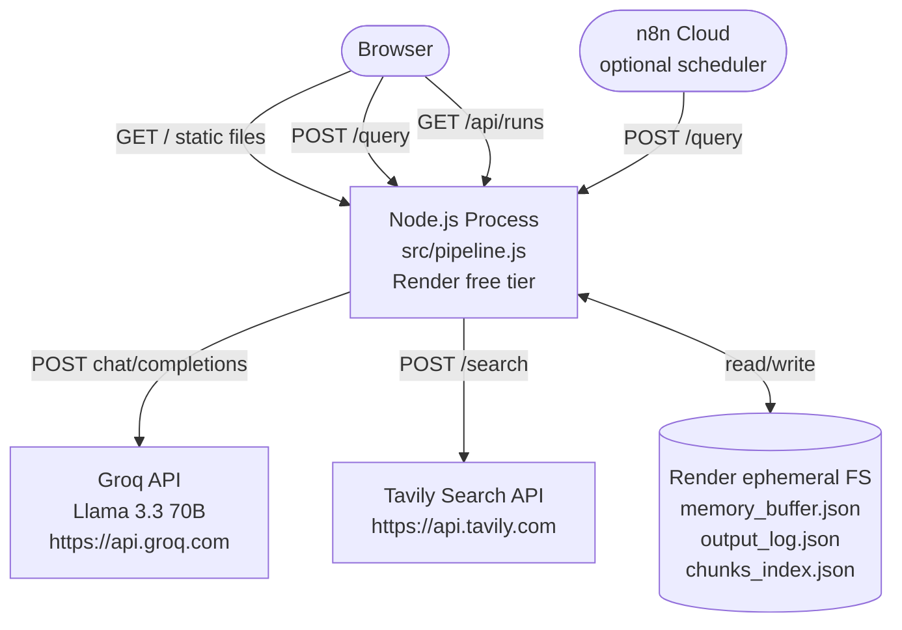

# Architecture Diagram — G3 Deep Research Agent

## System Overview

```mermaid
flowchart TD
    User([User]) -->|query string| CLI[CLI / HTTP POST /query]
    CLI --> Decomposer[Query Decomposer\nGroq LLM]
    Decomposer -->|2–3 sub-questions| Loop

    subgraph Loop [Per Sub-Question Loop — max 3 iterations]
        Tavily[Tavily Web Search\nmax 3 results]
        DocStore[Document Chunk Retrieval\nchunks_index.json\nkeyword scored]
        Memory[Episodic Memory Read\nmemory_buffer.json\ntop 5 entries]
        BudgetGate[Token Budget Gate\n1,600 token ceiling\nscore → sort → drop]
        ContextAssembler[Context Assembler\nverify ≤ 2,000 tokens total]
        ResearchLLM[Research LLM Call\nGroq — Llama 3.3 70B]
        Summariser[Summariser\nGroq — compress to ≤150 tokens]

        Tavily --> BudgetGate
        DocStore --> BudgetGate
        Memory --> BudgetGate
        BudgetGate --> ContextAssembler
        ContextAssembler --> ResearchLLM
        ResearchLLM --> Summariser
    end

    Loop --> Synthesiser[Final Synthesiser\nGroq — ≤400 token answer]
    Synthesiser --> QualityGate{Quality Gate\nsuccess + fresh source?}
    QualityGate -->|yes| MemWrite[Write to memory_buffer.json\none entry per run]
    QualityGate -->|no| Skip[Skip memory write]
    MemWrite --> LogWriter[Evidence Log Writer\nappend to output_log.json]
    Skip --> LogWriter
    LogWriter --> Response([Final answer + run_id\nreturned to caller])
```

## Token Budget Flow

```mermaid
flowchart LR
    Total[2,000 token ceiling\nper sub-question call]
    Total --> Overhead[400 tokens reserved\nfor prompt overhead\nsystem prompt + sub-question + formatting]
    Total --> Context[1,600 tokens\nfor retrieved context]
    Context --> Web[Web snippets\nTavily top 3]
    Context --> Docs[Doc chunks\nkeyword top 3]
    Context --> Mem[Memory summaries\ntop 5 entries]
    Web & Docs & Mem --> Scorer[Keyword overlap score\nall items ranked]
    Scorer --> Keep[Kept items\ncumulative ≤ 1,600]
    Scorer --> Drop[Dropped items\nlogged with reason:\nbudget exceeded]
```

## Deployment Topology

```mermaid
flowchart TD
    Browser([Browser]) -->|GET / static files| NodeServer[Node.js Process\nsrc/pipeline.js\nRender free tier]
    Browser -->|POST /query| NodeServer
    Browser -->|GET /api/runs| NodeServer
    NodeServer -->|POST chat/completions| Groq[Groq API\nLlama 3.3 70B\nhttps://api.groq.com]
    NodeServer -->|POST /search| Tavily[Tavily Search API\nhttps://api.tavily.com]
    NodeServer <-->|read/write| FS[(Render ephemeral FS\nmemory_buffer.json\noutput_log.json\nchunks_index.json)]
    n8n([n8n Cloud\noptional scheduler]) -->|POST /query| NodeServer
```
